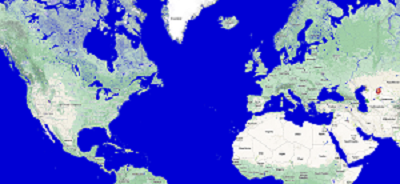

<marquee direction = "up">This text will scroll from bottom to
up</marquee>

## Secondary Climate Data

As evidenced by the historic drought in Indonesia, rainfall extremes,
vast wildfires, and soaring temperatures across the country , climate
change is already on our doorstep, and Indonesia's oil palm producers
are on the front lines. We are operating in new territory, and the
changing climate creates immense uncertainty and threatens the
resilience. This page consists of various sources that was designed to
access secondary data and interactively visualize agroclimate-related
data.  

**Source 1. Fire Data.**

 

**Source 2. Seasonal CLimate Forecast.**

 

**Source 3. Climate Engine.**

 

**Source 4. SPEI Index**

 

**Source 5. Surface Water Explorer**

 

**Source 6. Water Stress**

 

**Source 7. Gadas Agricultur**

 

**Source 8. CHRS Rainsphere**

 

**Source 9. Weather Radar**

 

**Source 10. FAO Aquamaps**

## Help & feedback

For additional help or to submit feedback or bug reports, please
contact:\
Didi Adisaputro Climatology Section
[Sect.head.climatology\@sinarmas-agri.com](mailto:Sect.head.climatology@sinarmas-agri.com){.email}
